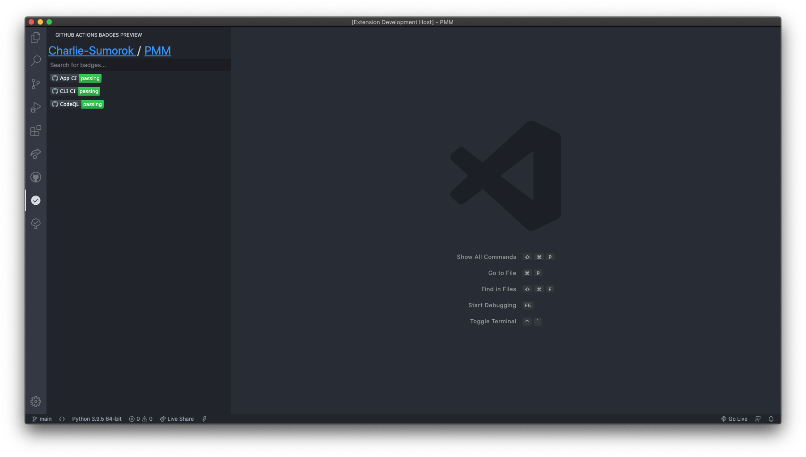

# vscode-github-actions-badges README

<!-- This is the README for your extension "vscode-github-actions-badges". After writing up a brief description, we recommend including the following sections. -->

## Features

### View all Github Actions Badges in the current repository

### [Filter Badges](images/filter-badges.mov) in the sidebar

<!--  -->

### [Click on a badge](images/click-badge.mov) to view it on GitHub.com

<!--  -->

### [Select a badge](images/select-badge.mov) to view on GitHub.com via the command pallete

<!--  -->

### [View All badges](images/all-badges.mov) on GitHub.com

<!--  -->

<!-- > Tip: Many popular extensions utilize animations. This is an excellent way to show off your extension! We recommend short, focused animations that are easy to follow. -->

<!-- ## Requirements

If you have any requirements or dependencies, add a section describing those and how to install and configure them. -->

<!-- ## Extension Settings

Include if your extension adds any VS Code settings through the `contributes.configuration` extension point.

For example:

This extension contributes the following settings:

- `myExtension.enable`: enable/disable this extension
- `myExtension.thing`: set to `blah` to do something -->

<!-- ## Known Issues

Calling out known issues can help limit users opening duplicate issues against your extension. -->

<!-- ## Release Notes

Users appreciate release notes as you update your extension.

### 1.0.0

Initial release of ...

### 1.0.1

Fixed issue #.

### 1.1.0

Added features X, Y, and Z.

--- -->

<!-- ## Following extension guidelines

Ensure that you've read through the extensions guidelines and follow the best practices for creating your extension.

- [Extension Guidelines](https://code.visualstudio.com/api/references/extension-guidelines) -->
